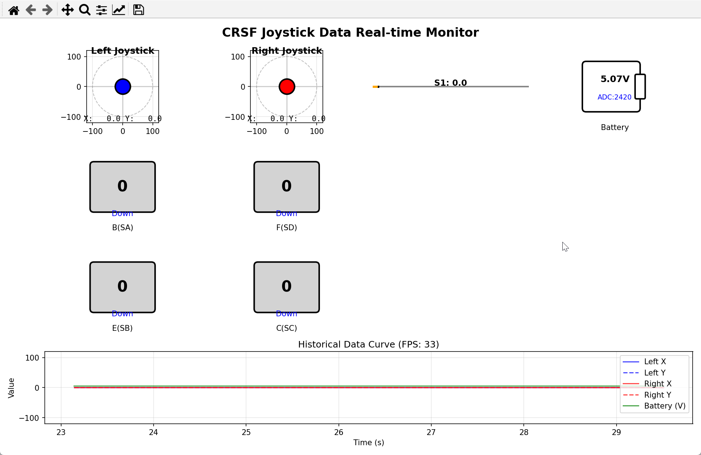

# ButterflyKeil

基于 STM32G0 的蝴蝶飞行器控制系统，使用 Keil 开发。

## 功能特性

- **电机控制**：支持 4 路直流电机 PWM 调速，带方向控制
- **CRSF 协议**：支持 ELRS 遥控器 CRSF 协议接收
- **LED 指示**：系统状态指示灯

## 硬件配置

### MCU

- 芯片：STM32G0 系列
- 开发环境：Keil MDK

### 引脚分配

| 功能   | 引脚   | 说明              |
| ---- | ---- | --------------- |
| LED  | PB4  | 状态指示灯（低电平有效）    |
| PWM1 | PC6  | 电机1 PWM 输出      |
| PWM2 | PA7  | 电机2 PWM 输出      |
| PWM3 | PB0  | 电机3 PWM 输出      |
| PWM4 | PB1  | 电机4 PWM 输出      |
| DIR1 | PA8  | 电机1 方向控制        |
| DIR2 | PA11 | 电机2 方向控制        |
| DIR3 | PA12 | 电机3 方向控制        |
| DIR4 | PA15 | 电机4 方向控制        |
| TX   | PB6  | USART1 发送（CRSF） |
| RX   | PB7  | USART1 接收（CRSF） |

## 模块说明

### 电机控制模块 (motor.c/h)

```c
// 初始化
MotorControl_Init();

// 设置电机速度 (-1000 ~ 1000，正值正转，负值反转)
Motor_SetSpeed(MOTOR_1, 500);

// 停止电机
Motor_Stop(MOTOR_1);
Motor_StopAll();

// 获取电机状态
Motor_Status_t status = Motor_GetStatus(MOTOR_1);
```

### CRSF 协议模块 (crsf.c/h)

解析 ELRS 遥控器发送的 CRSF 协议数据。

```c
// 遥控器数据结构
crsf_data.Left_X      // 左摇杆 X 轴 (-100 ~ 100)
crsf_data.Left_Y      // 左摇杆 Y 轴 (0 ~ 100)
crsf_data.Right_X     // 右摇杆 X 轴 (-100 ~ 100)
crsf_data.Right_Y     // 右摇杆 Y 轴 (-100 ~ 100)
crsf_data.S1          // 左滑块 (0 ~ 100)
crsf_data.S2          // 右滑块 (0 ~ 100)
crsf_data.A           // 左按键 A (0/1)
crsf_data.B           // 拨杆 B (0/1/2)
crsf_data.C           // 拨杆 C (0/1/2)
crsf_data.D           // 右按键 D (0/1)
crsf_data.E           // 拨杆 E (0/1/2)
crsf_data.F           // 拨杆 F (0/1/2)
```

## 工具说明

### 摇杆数据监控工具 (tools/joystick_monitor.py)

这是一个基于Python的实时数据监控工具，用于显示遥控器摇杆数据和电池电压。



**功能特点：**

- **实时数据显示**：左摇杆、右摇杆、滑块位置
- **开关状态监控**：B(SA)、F(SD)、E(SB)、C(SC)开关状态
- **电池电压监控**：实时显示电池电压和原始ADC值
- **历史曲线**：显示摇杆数据和电池电压的变化曲线
- **帧率显示**：实时显示数据更新帧率

**使用方法：**

```bash
# 安装依赖
pip install pyserial matplotlib

# 运行监控工具
python tools/joystick_monitor.py -p COM4 -b 420000

# 查看可用串口
python tools/joystick_monitor.py -l
```

**数据格式：**

工具接收来自STM32的CSV格式数据：

```
Left_X,Left_Y,Right_X,Right_Y,S1,S2,A,B,C,D,E,F,BatteryVoltage,ADCValue
```

## 编译与烧录

1. 使用 Keil MDK 打开项目文件
2. 编译项目（Build）
3. 连接 ST-Link 下载器
4. 点击 Download 烧录

## 目录结构

```
ButterflyKeil/
├── Core/
│   ├── Inc/                # 头文件
│   │   ├── main.h
│   │   ├── motor.h         # 电机控制模块
│   │   ├── crsf.h          # CRSF 协议模块
│   │   └── ...
│   └── Src/                # 源文件
│       ├── main.c          # 主程序
│       ├── motor.c         # 电机控制实现
│       ├── crsf.c          # CRSF 协议实现
│       └── ...
├── Drivers/                # STM32 HAL 驱动
└── ButterflyKeil.ioc       # STM32CubeMX 配置文件
```

## 注意事项

1. LED 为**低电平有效**，使用 `LED_ON()` 点亮，`LED_OFF()` 熄灭
2. 电机速度范围：-1000 ~ 1000
3. CRSF 数据通过 USART1 + DMA 接收

## 许可证

MIT License