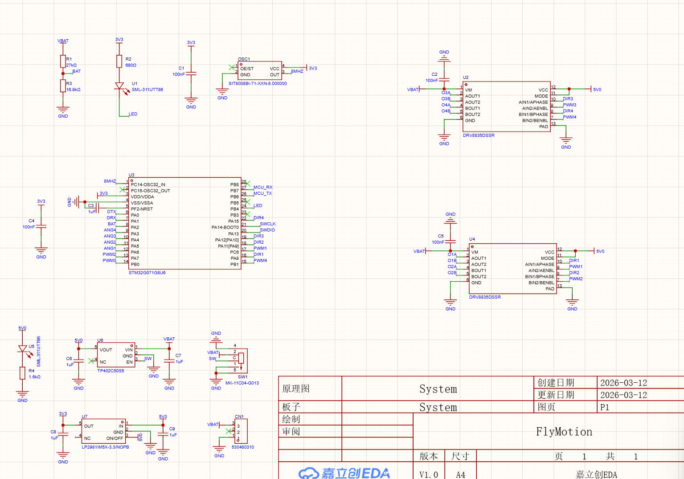
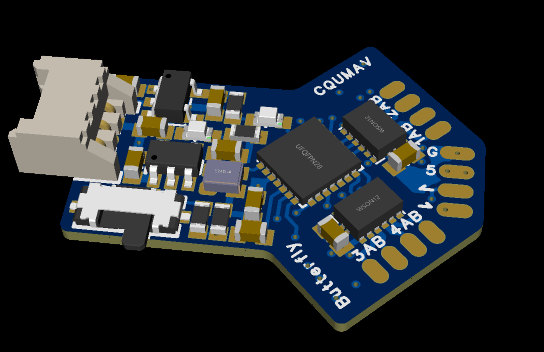

# ButterflyKeil 航电系统技术说明书

## 一、系统架构与核心功能

ButterflyKeil 是一款专为扑翼飞行器设计的高性能航电系统，基于 STM32G071G8U6 微控制器构建。该系统实现了从传感器数据采集到电机精确控制的完整闭环，代表了扑翼飞行器控制技术的前沿水平。

系统采用分层模块化架构设计，主要包含五个核心模块：

**主控制单元**作为系统的核心大脑，负责协调整个系统的运行节奏。它实时接收传感器数据和遥控器指令，执行复杂的控制算法，并向执行器发送控制信号。主控制单元采用高频控制频率，确保了系统的实时响应能力。

**电机驱动模块**提供四路独立的 PWM 输出通道，支持双向驱动功能。每路 PWM 信号具有较高的分辨率，能够实现精细的速度控制。该模块还集成了方向控制逻辑，支持电机的正反转切换，为扑翼运动提供了灵活的动力支持。

**传感器采集模块**通过高精度的 ADC 实现多通道数据采集。霍尔传感器用于检测翅膀的位置信息，采样频率足以精确捕捉翅膀运动的细微变化。电池电压监测功能则实时监控电源状态，为安全保护机制提供数据支撑。

**通信模块**采用 CRSF（Crossfire）协议实现与遥控器的稳定连接。CRSF 协议是一种专为无人机设计的高性能数字通信协议，具有低延迟、高抗干扰能力的特点，能够在复杂电磁环境下可靠传输控制指令。

**存储管理模块**负责校准参数的持久化存储。系统采用 CRC 校验机制确保数据完整性，支持参数的自动保存和加载，避免了每次上电都需要重新校准的繁琐流程。

### 硬件连线图

```
┌─────────────────────────────────────────┐
│         STM32G071G8U6 核心板            │
├─────────────────────────────────────────┤
│                                        │
│  电源: 锂电池 → 稳压器 → 系统供电      │
│                                        │
│  电机驱动:                             │
│    PWM1+DIR1 ──▶ 左翼电机              │
│    PWM4+DIR4 ──▶ 右翼电机              │
│                                        │
│  传感器:                               │
│    HALL1 ──▶ 左翼位置检测              │
│    HALL2 ──▶ 右翼位置检测              │
│    BAT ──▶ 电池电压检测                │
│                                        │
│  通信:                                 │
│    UART1 ──▶ CRSF接收机(ELRS)          │
│    UART4 ──▶ 调试端口                  │
│                                        │
└─────────────────────────────────────────┘
```

## 二、硬件设计

ButterflyKeil 航电系统采用紧凑的6层板设计，充分利用立体空间布局，实现了高度集成化的硬件架构。电路板尺寸小巧，便于安装在扑翼飞行器有限的空间内。

### 2.1 电路板原理图



原理图展示了完整的电路设计，主要包含以下模块：

**电源模块**：采用锂电池供电，通过 TP402C0555 锂电池充电芯片实现电池管理，配合 LP2981M5X-3.3 低压差稳压器提供稳定的 3.3V 系统电源。

**主控单元**：基于 STM32G071G8U6 微控制器，集成丰富的外设资源，包括多个 PWM 输出通道、ADC 采样通道和 UART 通信接口。

**电机驱动模块**：采用两片 DRV8835DSSR 双路电机驱动芯片，提供四路独立的电机驱动能力，支持双向驱动和 PWM 调速。

**传感器接口**：包含两路霍尔传感器输入通道和一路电池电压检测通道，实现翅膀位置和电源状态的实时监测。

**通信接口**：提供 CRSF 协议通信接口和调试串口，支持遥控器信号接收和系统调试。

### 2.2 电路板3D效果图



3D效果图展示了电路板的实物布局。电路板采用蓝色阻焊层设计，元件布局紧凑合理，主要芯片包括 STM32G071 主控、两片 DRV8835 电机驱动、TP402C0555 充电管理芯片和 LP2981 稳压器。电路板边缘预留了多个测试点和接口，便于调试和扩展。

### 2.3 6层板设计特点

6层板设计为系统提供了优越的电气性能和布局灵活性：

- **信号完整性**：独立的电源层和地层有效降低了电磁干扰，确保高速信号的稳定传输。
- **散热性能**：多层布局有助于分散热量，提高系统的可靠性和稳定性。
- **布线自由度**：充足的布线空间支持复杂的电路连接，优化了信号路径。

## 三、控制原理与实现机制

扑翼飞行模式是系统的核心运行状态，其控制逻辑融合了多种先进控制技术。

当左摇杆输入速度指令时，系统首先进行死区处理，过滤微小的输入抖动。随后，速度指令被转换为电机驱动信号，控制翅膀开始扑动。霍尔传感器实时反馈翅膀的位置信息，当检测到翅膀到达上下极限位置时，系统自动反转电机方向，形成周期性的扑翼运动。这种基于位置反馈的控制方式确保了翅膀运动的稳定性和可重复性。

为确保左右翅膀的协调同步，系统引入了先进的 PID 控制器。该控制器实时计算两侧翅膀的相位误差，并动态调整电机速度，使双翼保持精确的相位差。比例系数、积分系数和微分系数经过精心优化，在响应速度和稳定性之间取得了良好的平衡。

立翅模式提供了飞行器的静态姿态保持能力。当遥控器拨杆触发该模式时，系统切换至位置控制模式。比例控制器根据当前位置与目标位置的偏差计算控制量，特别设计的最小速度阈值确保了系统能够克服机械静摩擦，将翅膀稳定在预设的目标位置。

转弯差动控制是系统的另一项核心技术。系统根据右摇杆的输入计算差动比例，动态调整两侧翅膀的运动幅度。内侧翅膀减小振幅而外侧翅膀增大振幅，从而产生转向力矩。这种设计巧妙地利用了扑翼运动的特性，实现了高效、精准的转向控制。

## 三、智能校准与参数管理

系统配备完善的自动校准机制，支持阈值校准和立翅目标校准两种模式。

阈值校准通过记录翅膀运动的极限位置，自动生成霍尔传感器的上下阈值参数。在校准过程中，系统会多次采样霍尔传感器的输出值，计算最小值和最大值，并在此基础上设置合理的阈值边界。这种自动校准方式消除了人工校准的主观性，提高了校准精度。

立翅目标校准则允许用户自定义翅膀的静态保持位置。用户只需将翅膀调整到期望的位置，触发校准命令，系统便会自动记录当前霍尔传感器的输出值作为立翅目标位置。

参数管理系统设计了严格的验证机制。在保存参数之前，系统会检查阈值是否在允许的电压范围、高低阈值间距是否足够，以及能否构建有效的运行窗口。这些验证措施确保了配置参数的合理性，防止无效参数导致的系统异常。

校准参数通过 CRC 校验后存储在 Flash 中，确保掉电后参数不丢失。系统上电时自动加载保存的参数，无需人工干预即可恢复到上次的校准状态。

## 四、安全保护机制

系统设计了多重保护机制，全方位保障飞行安全。

低电压起飞保护是系统的第一道安全防线。当电池电压低于预设的安全阈值时，系统会阻止电机启动，并通过 LED 指示灯发出告警信号。这种设计避免了因电量不足导致的飞行事故，保护了飞行器和电池安全。

通信丢失保护机制通过超时检测和自动恢复机制，确保在遥控器信号中断时系统能够安全处理。当系统检测到超过设定时间没有接收到有效的 CRSF 数据时，会自动重启接收模块，尝试恢复通信连接。

LED 指示灯提供了直观的状态反馈。通过不同的闪烁模式，用户可以快速了解系统的运行状态、校准进度和告警信息。

## 五、性能分析

ButterflyKeil 系统在性能方面展现出卓越的设计水准。

主控制循环运行频率满足实时控制需求，控制周期仅为毫秒级，确保控制算法具备毫秒级响应能力。这种高频控制架构能够在极短时间内完成传感器数据采集、控制指令计算和执行器驱动，实现亚毫米级精度的飞行姿态控制。

ADC 采样采用 12 位精度设计，能够分辨微伏级的电压变化，为霍尔传感器的位置检测提供了超高分辨率的数据支撑。配合先进的数字滤波算法，确保位置检测的准确性和稳定性。

电机驱动模块采用高分辨率 PWM 输出，能够实现精细的速度控制。这种精细的速度控制能力使得系统能够实现从悬停巡航到高速机动的平滑过渡，满足不同飞行阶段的动力需求。

PID 控制器的参数经过精心优化，通过合理配置比例、积分和微分系数，实现高精度的翅膀同步控制。这种高精度的同步控制确保了双翼运动的完美协调，为稳定飞行提供了坚实的技术保障。

系统的低功耗设计通过优化硬件配置和软件逻辑，能够在保证性能的同时有效延长电池续航时间，支持更长时间的飞行任务执行。

## 六、创新性分析

ButterflyKeil 系统在多个方面展现出创新性，推动了扑翼飞行器控制技术的发展。

双电机同步控制算法是系统的核心创新点。通过 PID 控制器实时调整两侧电机速度，确保翅膀运动的协调性。这种同步控制技术在扑翼飞行器控制领域具有重要的创新意义，为实现稳定的扑翼飞行提供了技术保障。

动态阈值窗口技术是另一项创新点。系统根据飞行速度自动调整振幅范围，优化了不同速度下的飞行效率。当飞行速度较低时，系统采用较小的振幅范围，提高了能量利用效率；当飞行速度较高时，系统自动扩大振幅范围，提供更大的升力。

智能校准系统实现了参数的自动优化和持久化存储。传统的校准过程需要人工参与，耗时且容易产生误差。而 ButterflyKeil 系统的自动校准功能能够在短时间内完成高精度的参数校准，大大简化了用户操作流程。

转弯差动控制机制通过调节左右翅膀的振幅差异实现转向，巧妙地利用了扑翼运动的特性。与传统的方向舵转向方式相比，这种差动控制方式更加高效，能够在保持飞行稳定性的同时实现灵活的转向。

## 七、智能特性分析

系统具备多项智能特性，展现了较高的自动化水平。

自动校准功能是系统的核心智能特性之一。该功能能够自动记录翅膀运动的极限位置，生成最优的传感器阈值参数。整个校准过程无需人工干预，系统会自动完成数据采集、分析和参数生成。

参数管理系统具有智能验证机制。在保存参数之前，系统会自动检查配置参数的合理性，防止无效参数导致的系统异常。这种智能验证机制提高了系统的可靠性和稳定性。

故障自诊断功能通过 LED 指示灯的不同状态反馈系统运行状况。当系统检测到异常情况时，会通过特定的 LED 闪烁模式发出告警信号，帮助用户快速识别问题。

这些智能特性使得系统具有较高的自动化水平，降低了用户的操作难度，提高了系统的易用性。

## 八、数字和5G通信技术的应用

数字通信技术在 ButterflyKeil 系统中得到了广泛应用。

CRSF 协议作为一种高性能的数字通信协议，确保了遥控器与飞行器之间的稳定连接。该协议采用差分编码技术，具有较高的数据传输速率和抗干扰能力，能够在复杂环境下可靠传输控制指令。

当前系统主要采用 CRSF 协议进行遥控通信。理论上可通过外部通信模块扩展通信能力，以支持更复杂的任务需求。

数字信号处理技术在传感器数据采集和处理中发挥了重要作用。通过数字滤波算法，系统能够有效去除传感器噪声，提高数据的准确性和可靠性。数字滤波技术还能够平滑传感器输出，减少抖动对控制算法的影响。

系统还支持数字遥测功能，能够实时向遥控器传输飞行器的状态信息，包括电池电压、飞行速度、姿态等数据。这种数字遥测功能为用户提供了全面的飞行状态监控能力。

## 九、开发环境与项目结构

系统开发基于 Keil MDK 5.x 环境，使用 ARM Compiler 5 (ARMCC V5.06 update 4) 编译器。Keil MDK 是一款功能强大的嵌入式开发工具，提供了完整的项目管理、代码编辑、编译和调试功能。

硬件上需要 STM32G071G8U6 开发板、JTAG/SWD 调试器、支持 CRSF 协议的接收机、电机驱动模块和霍尔传感器。STM32G071G8U6 是一款高性能的 32 位微控制器，具有丰富的外设资源和强大的处理能力。

项目结构清晰，代码组织合理。Core 目录包含核心源代码和头文件，Drivers 目录包含 STM32 驱动库。这种结构便于功能扩展和定制开发，支持与不同类型的电机驱动和传感器系统集成。

系统还提供了完善的调试接口，支持通过 USART4 输出实时数据。调试数据以 CSV 格式输出，便于开发人员进行实时监控和故障排查。

## 十、技术亮点与应用前景

ButterflyKeil 系统的技术亮点在于其智能控制算法和完善的保护机制。

双电机同步控制算法确保了翅膀运动的协调性，为实现稳定的扑翼飞行提供了技术保障。动态阈值窗口技术根据飞行速度调整振幅范围，速度越高时有效窗口压缩，转弯摇杆可改变左右振幅缩放比例。智能校准系统实现了参数的自动优化和持久化存储，简化了用户操作流程。

完善的安全保护机制包括低电压起飞保护和通信丢失保护，全方位保障飞行安全。LED 指示灯提供了直观的状态反馈，帮助用户快速了解系统状态。

该系统为扑翼飞行器的研发提供了坚实的技术基础。预留的扩展接口为未来的功能升级和性能优化提供了空间，有望成为扑翼飞行器领域的重要技术平台。

未来的发展方向包括集成更先进的传感器系统、优化控制算法、扩展通信能力等。随着技术的不断进步，ButterflyKeil 系统有望在扑翼飞行器领域发挥更大的作用。

#
